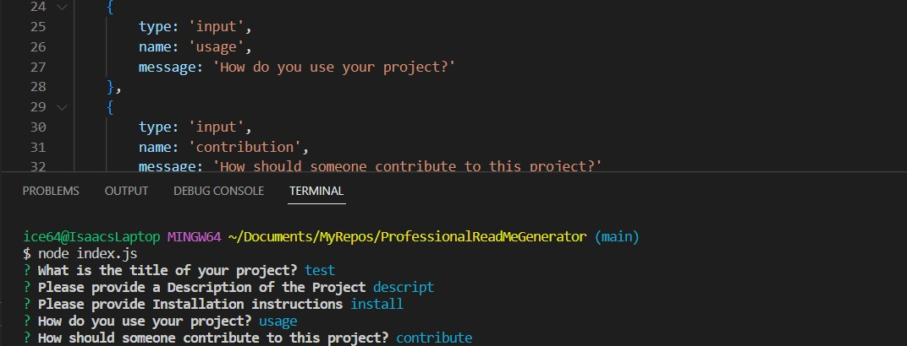
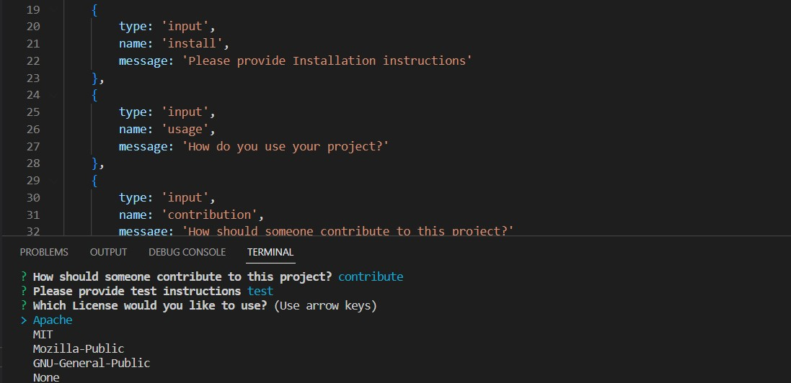
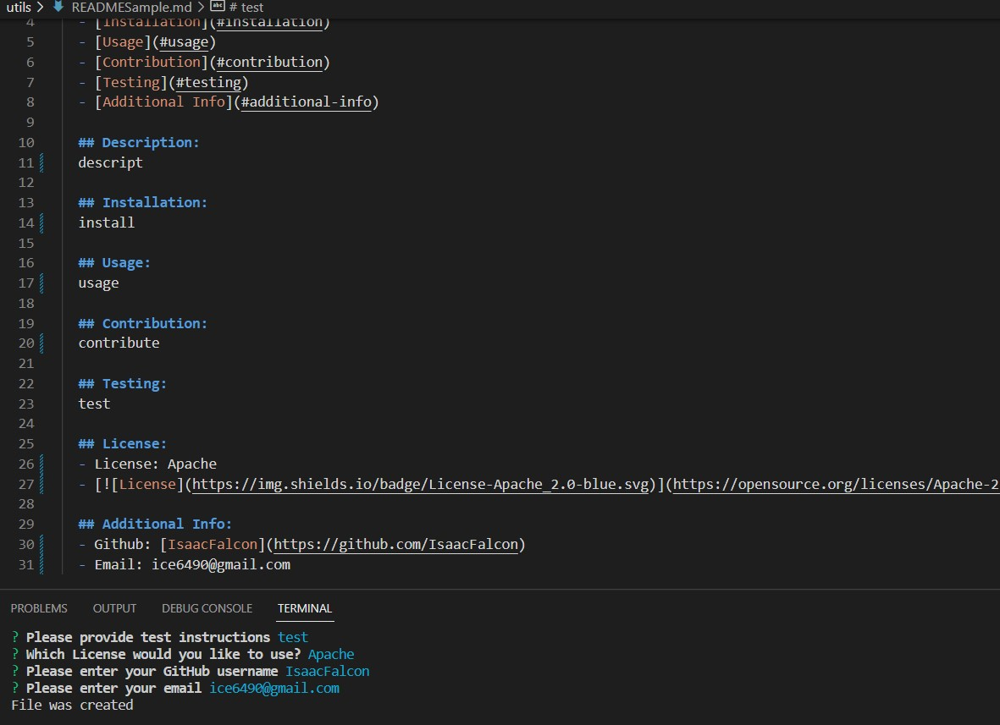

# ProfessionalReadMeGenerator

## Description

-A Generator created in node with JavaScript to help easily create a README file for any project.

## Description
- A command-line application that accepts user input
- I am prompted for information about my application repository and when entered a high-quality, professional README.md is generated.
- If you enter project title it is displayed as the title of the README
- If you enter a description, installation instructions, usage information, contribution guidelines, and test instructions it is added to the sections of the README entitled Description, Installation, Usage, Contributing, and Tests
- If you choose a license for the application from a list of options a badge for that license is added for README and type of license is added to the section.
- You can also input email and github and it will link to the corresponding input.

## Table of Contents

- [Usage](#usage)
- [Credits](#credits)
- [License](#license)

## Usage

Instructions:
- download through this github.
- inquirer must be installed if not already.
- Open up terminal.
- Make sure you are in folder with index.js.
- type node index.js
- answer prompted questions.
- On success a README will be generated in the utils folder.

Link to Video: https://drive.google.com/file/d/1WBgx4Vy3EFa6LnGwIOCvRZI694LyMbA7/view?usp=sharing 

## Credits

Node.js

## License

MIT License

Copyright (c) [2022] [Isaac Falcon]

Permission is hereby granted, free of charge, to any person obtaining a copy
of this software and associated documentation files (the "Software"), to deal
in the Software without restriction, including without limitation the rights
to use, copy, modify, merge, publish, distribute, sublicense, and/or sell
copies of the Software, and to permit persons to whom the Software is
furnished to do so, subject to the following conditions:

The above copyright notice and this permission notice shall be included in all
copies or substantial portions of the Software.

THE SOFTWARE IS PROVIDED "AS IS", WITHOUT WARRANTY OF ANY KIND, EXPRESS OR
IMPLIED, INCLUDING BUT NOT LIMITED TO THE WARRANTIES OF MERCHANTABILITY,
FITNESS FOR A PARTICULAR PURPOSE AND NONINFRINGEMENT. IN NO EVENT SHALL THE
AUTHORS OR COPYRIGHT HOLDERS BE LIABLE FOR ANY CLAIM, DAMAGES OR OTHER
LIABILITY, WHETHER IN AN ACTION OF CONTRACT, TORT OR OTHERWISE, ARISING FROM,
OUT OF OR IN CONNECTION WITH THE SOFTWARE OR THE USE OR OTHER DEALINGS IN THE
SOFTWARE.

---

## Badges

